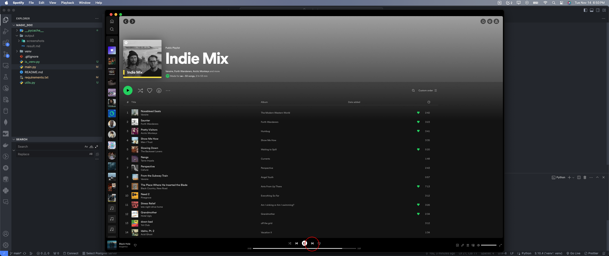
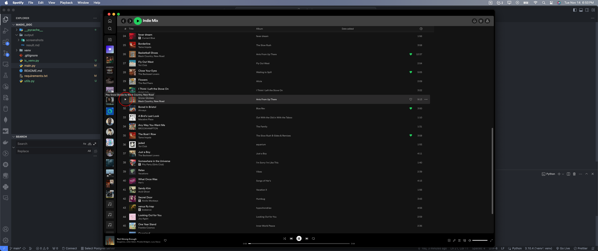
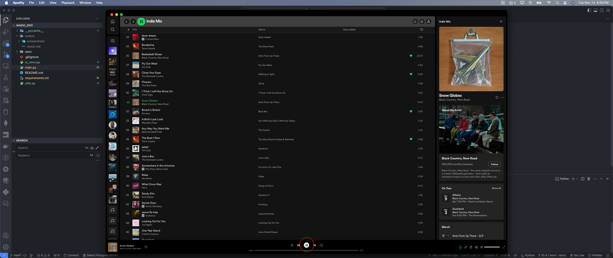
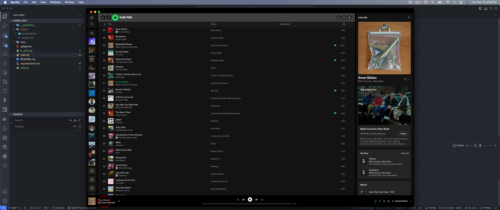
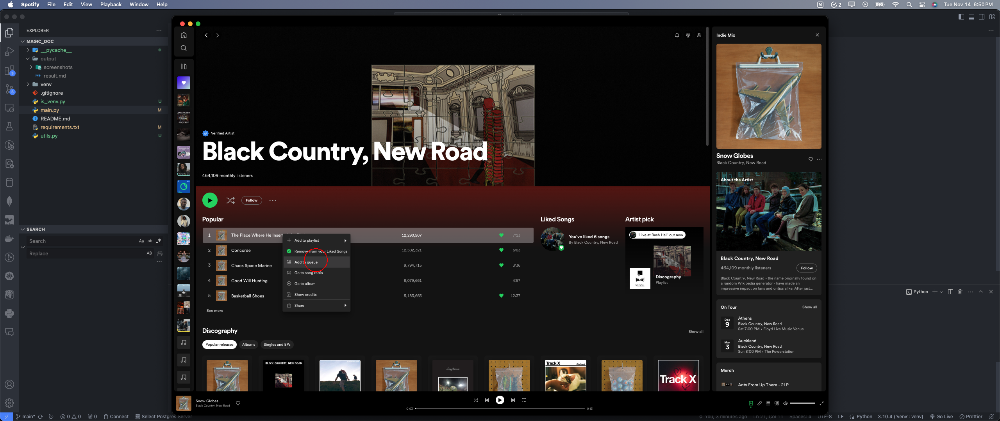
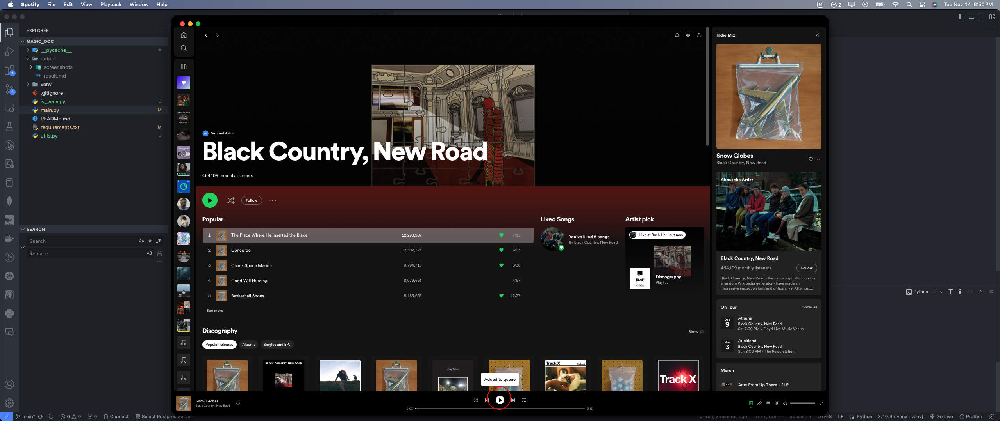
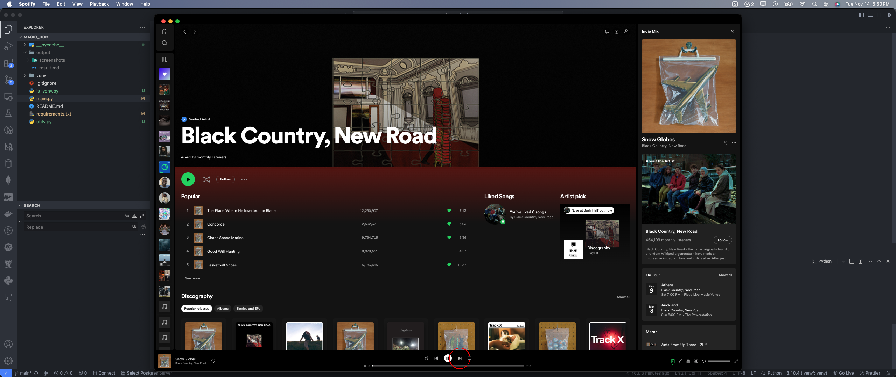
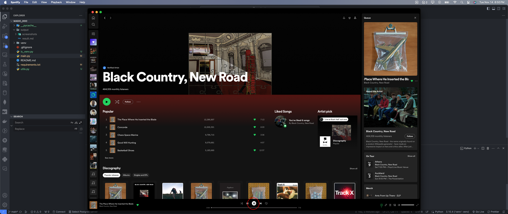
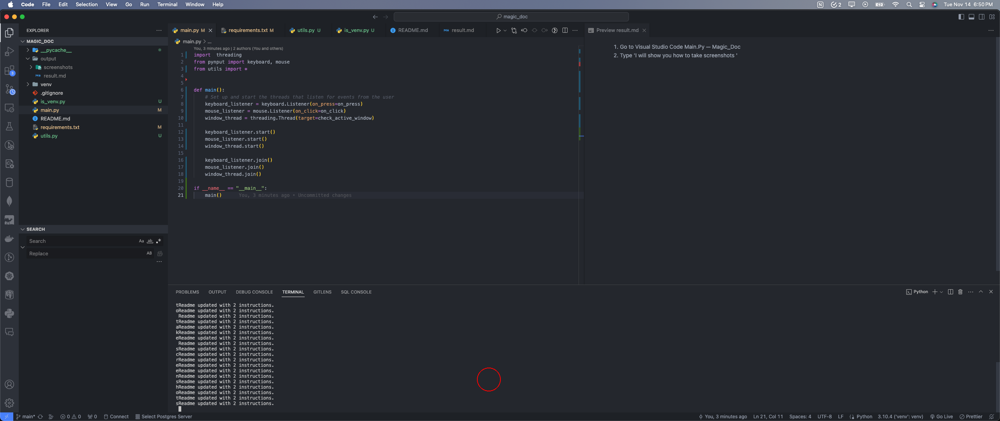

1. Go to Visual Studio Code Main.Py — Magic_Doc
2. Type 'I will show you how to take screenshots '
3. Go to Spotify Boygenius - Black Hole
4. Go to Spotify Boygenius - Not Strong Enough
5. 

6. Go to Spotify Black Country, New Road - Snow Globes
7. 

8. 

9. Go to Spotify Spotify Premium
10. 

11. 

12. 

13. 

14. Go to Spotify Black Country, New Road - Snow Globes
15. Go to Spotify Black Country, New Road - The Place Where He Inserted The Blade
16. 

17. Type ''
18. 

19. Type ''
20. Go to Visual Studio Code Main.Py — Magic_Doc
21. 

22. Type 'cc'
