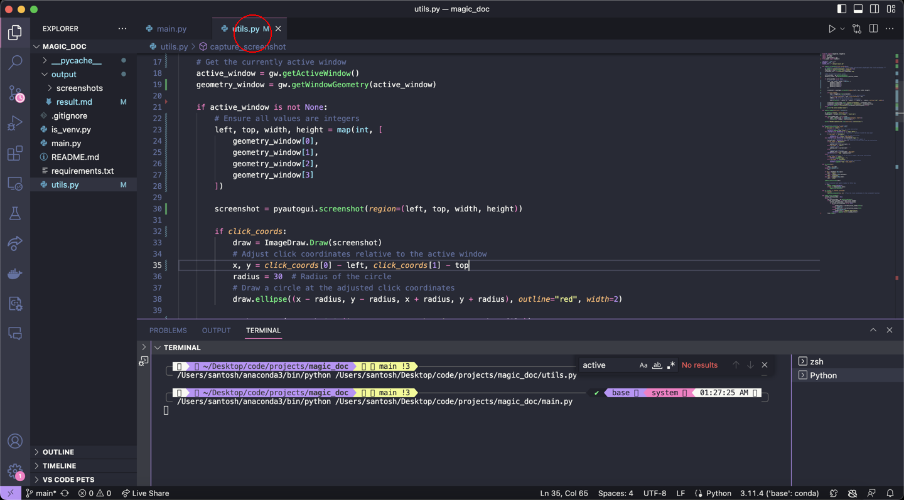
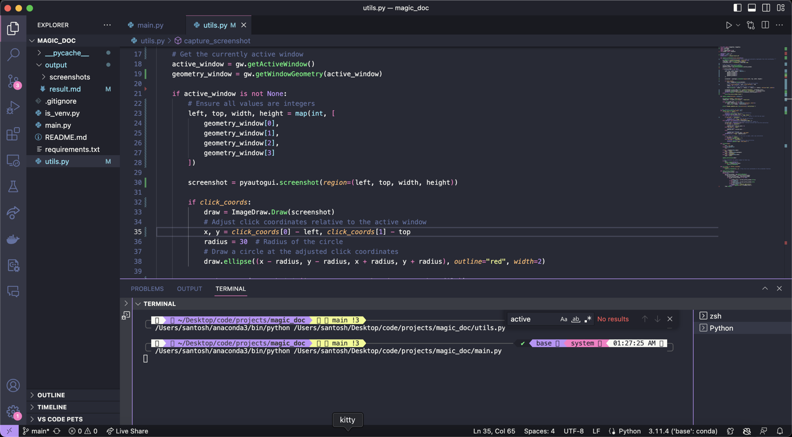
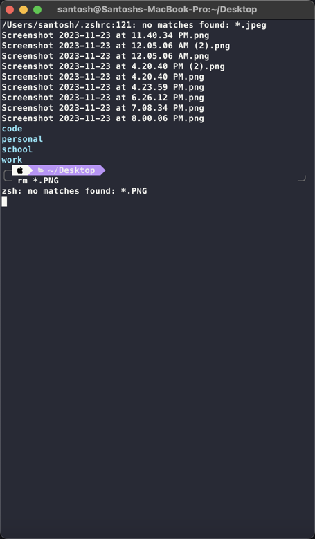
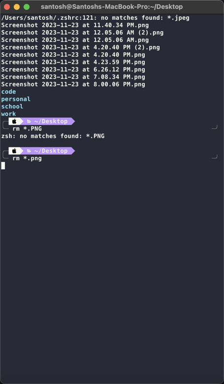
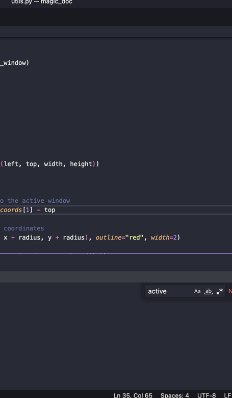

1. Go to Code Main.Py — Magic_Doc
2. 

3. Go to Code Utils.Py — Magic_Doc
4. 

5. Go to Kitty Zsh
6. Go to Kitty Santosh@Santoshs-Macbook-Pro:~/Desktop
7. Type 'rm *.PNG'
8. Type 'Enter'
9. 

10. Type 'png'
11. Type 'Enter'
12. 

13. Type 'clear'
14. Type 'Enter'
15. 

16. 

17. Go to Code Utils.Py — Magic_Doc
18. Type 'cc'
